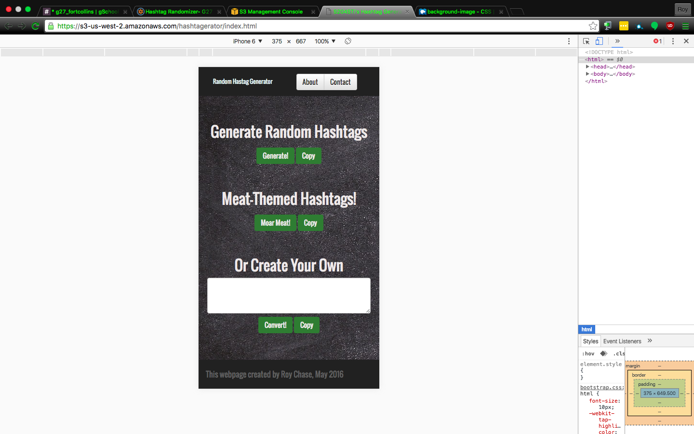
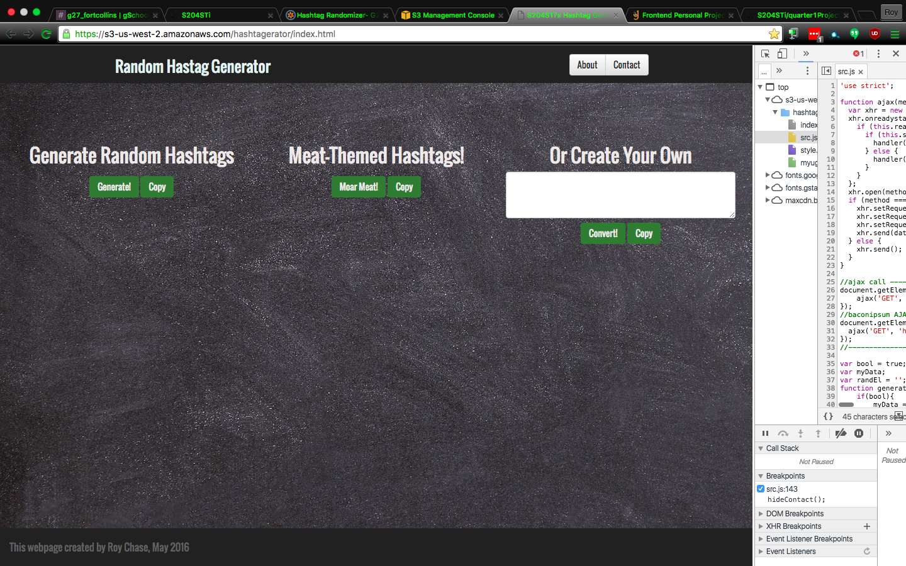
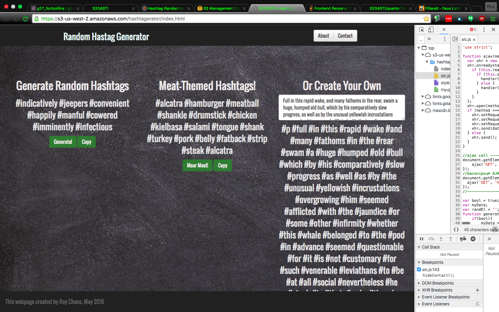

Quarter 1 Front End Project
Roy Chase
Galvanize G27, 2016

Thanks for taking a look at this project. For my first quarter project at the code bootcamp Galvanize, I wanted to implement a light-hearted concept I'd thought of when I was first learning to code: a website that can generate random strings of hashtags for social media. I want to write code that is easy to read, and that does one thing well, and then add to that in a modular fashion, so starting with a simple AJAX request, and string parsing algorithm, I was able to access a random text API and successfully generate the content I desired, with a few minor corrections to be made later.

-----------Technologies Used ----------

-JavaScript
-HTML
-CSS
-Bootstrap

The JS, HTML, and CSS were written in Atom on a MacBook Air. The HTML header includes bootstrap CDNs in order to implement the basic grid functionality of BS, as well as some of the default appearance and behaviors that I wanted from certain elements. I avoided jQuery for this project, as I wanted to wrestle with the algorithms and syntax a bit and be comfortable with those before using it in future projects. I wanted to be semantic when it made sense with the HTML, but in many cases I ended up with specific divs with IDs instead, since that appears to be the norm when working with BS.

I used Node for early validation in the terminal, but once I had my basic HTML and CSS files built up, I did most all of my remaining validation in Chrome over port 8080. This allowed me to test responsiveness and behavior of the page.

------------Workflow-------------------

-Agile practices
-Pivotal Tracking

This was my first attempt at Agile development practices. Using Pivotal Tracker I was able to experiment with using their interface to create meaningful and thorough tasks with good descriptors. This was hugely helpful when I found myself in the doldrums each afternoon, wondering what I was doing again. In other words, productivity was significantly improved, and I was able to recall ideas and tasks I had conceptualized at some point but didn't have time to implement in that moment.

My first project priority was working JS. Second, and only just slightly less important, was that it function well on a mobile phone. Third, I worked to improve the full-screen appearance (which amusingly is slightly harder when your page has as little content as mine). Then I added features, such as a second AJAX request to an alternate random text API for flavor, and a string parsing algorithm to convert user-provided text into an appropriate (or inappropriate...) string of hashtags. This feature in particular I think I'm happiest with. Although it was probably the least involved, in terms of lines of code, I think it gives the website legs to be useful to a variety of users.

After I had working JS, and a responsive webpage, I went about refactoring my HTML and CSS in order to maximize my knowledge of Bootstrap at the time, and to minimize redundant CSS rules. I also made some styling changes during this phase, in an attempt to give the website a slightly more modern look. UI is not exactly my forte but it was fun to work with and to consider different use cases.

Finally, I deployed to Amazon Web Services. Partly this was because I wanted to play around with AWS, and partly because I wanted to share my achievement. A month ago I could barely write FizzBuzz code! So this was a big deal to me. The positive result of deploying late in the process before finalization was that I was able to see it on different clients, and found some bugs as a result. Also, it was good from a personal growth standpoint to understand how to deploy a static site via AWS, which is probably strongly relevant to future job requirements.

--------------TL;DR---------------------
Written in Atom;
Uses JavaScript and Bootstrap;
Designed to be responsive and mobile-first;
Deployed to AWS.

Thanks for taking the time to gaze upon this little project. If you have suggestions feel free to fork and send me a pull request.

Warm regards,
Roy

-------------ScreenShots----------------

